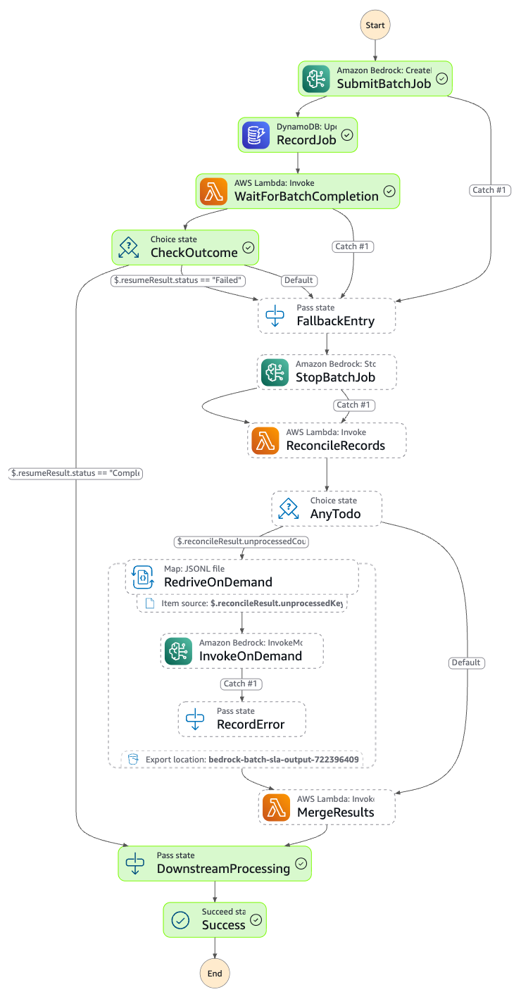

# Amazon Bedrock Batch Inference with On-Demand SLA Fallback

This workflow runs Amazon Bedrock **batch inference** as the primary (cost-effective) path, with **automatic fallback to on-demand inference** when an SLA deadline is at risk.

Learn more about this workflow at Step Functions workflows collection: https://serverlessland.com/workflows/bedrock-batch-with-sla

Important: this application uses various AWS services and there are costs associated with these services after the Free Tier usage - please see the [AWS Pricing page](https://aws.amazon.com/pricing/) for details. You are responsible for any AWS costs incurred. No warranty is implied in this example.

## Requirements

* [Create an AWS account](https://portal.aws.amazon.com/gp/aws/developer/registration/index.html) if you do not already have one and log in. The IAM user that you use must have sufficient permissions to make necessary AWS service calls and manage AWS resources.
* [AWS CLI](https://docs.aws.amazon.com/cli/latest/userguide/install-cliv2.html) installed and configured
* [Git Installed](https://git-scm.com/book/en/v2/Getting-Started-Installing-Git)
* [AWS CDK CLI](https://docs.aws.amazon.com/cdk/v2/guide/getting_started.html) installed (`npm install -g aws-cdk`)
* Python 3.12+

## Deployment Instructions

1. Create a new directory, navigate to that directory in a terminal and clone the GitHub repository:
    ```
    git clone https://github.com/aws-samples/step-functions-workflows-collection
    ```
1. Change directory to the pattern directory:
    ```
    cd step-functions-workflows-collection/bedrock-batch-with-sla
    ```
1. Create a virtual environment and install dependencies:
    ```
    uv venv && uv pip install -r requirements.txt
    ```
1. Bootstrap CDK (first time only):
    ```
    cdk bootstrap aws://<ACCOUNT_ID>/<REGION>
    ```
1. Deploy the stack:
    ```
    cdk deploy \
      -c modelId=us.anthropic.claude-sonnet-4-6 \
      -c slaTotalMinutes=360 \
      -c stuckThresholdMinutes=30 \
      -c maxConcurrency=20
    ```

### Parameters

| Parameter | Default | Description |
|-----------|---------|-------------|
| `modelId` | `us.anthropic.claude-sonnet-4-6` | Bedrock model ID |
| `slaTotalMinutes` | `360` | Total SLA budget in minutes |
| `stuckThresholdMinutes` | `30` | Minutes before stuck-job alarm fires |
| `maxConcurrency` | `20` | Max concurrent on-demand invocations during fallback |
| `safetyBufferMinutes` | `10` | Extra time buffer before cutoff |

1. Note the outputs from the CDK deployment. These contain the resource names and/or ARNs which are used for testing.

## How it works

```
S3 input (.jsonl)
  └─ Registrar λ
       └─ Step Functions
            ├─ SubmitBatchJob → RecordJob → WaitForBatchCompletion (task token)
            │
            ├─ Happy path: batch completes → DownstreamProcessing → Success
            │
            └─ Fallback path (timeout / alarm / failed job):
                 FallbackEntry → StopBatchJob → ReconcileRecords
                   └─ RedriveOnDemand (Distributed Map) → MergeResults → Success
```

The workflow uses two patterns:

**Callback Pattern (Task Token)** — Instead of polling Bedrock, Step Functions suspends and hands out a task token. The token is saved to DynamoDB. When the batch job finishes (or gets stuck), an external Lambda retrieves the token and calls `SendTaskSuccess` to resume the execution — at zero compute cost while waiting.

**Saga Pattern** — Each step has a compensating action so the system always reaches a clean terminal state. If `StopBatchJob` fails (job was already stopped), execution continues to `ReconcileRecords`.

### Three Fallback Triggers

| Trigger | Mechanism |
|---------|-----------|
| Timeout | `WaitForBatchCompletion` TimeoutSeconds expires |
| Stuck job | CloudWatch alarm (pending > 0, tokens == 0 for 30 min) → SNS → Trigger λ → `SendTaskSuccess` |
| Failed job | EventBridge → Resume λ → `SendTaskSuccess` |

All three converge on the same fallback path.

### SLA Timing

```
BATCH_CUTOFF = SLA_TOTAL - on_demand_drain_time - safety_buffer
```

Default: 360 min SLA − 30 min drain − 10 min buffer = **320 min batch cutoff**

## Image

Provide an exported .png of the workflow from [Workflow Studio](https://docs.aws.amazon.com/step-functions/latest/dg/workflow-studio.html) and add here.



## Testing

### Input format

Each line of the JSONL file uploaded to the input S3 bucket must have `recordId` and `modelInput`:

```jsonl
{"recordId": "rec-001", "modelInput": {"messages": [{"role": "user", "content": [{"text": "What is the capital of France?"}]}]}}
```

A ready-to-use `sample/input.jsonl` is included (requires minimum 1,000 records; some models require 10,000+).

### Trigger a job

```bash
aws s3 cp sample/input.jsonl s3://<INPUT_BUCKET>/input.jsonl
```

### Output locations

| Path | Contents |
|------|----------|
| `batch-output/<JOB_ID>/` | Raw batch results |
| `ondemand-results/<JOB_ID>/` | On-demand redrive results (fallback only) |
| `merged-output/<JOB_ID>/results.jsonl` | Final unified output, one result per `recordId` |

### Unit and integration tests

```bash
# Lambda unit tests
cd test/lambdas && python -m unittest discover

# All three fallback scenarios (~10-15 min)
bash test/integration/test-fallback-scenarios.sh
```

## References

- [Bedrock Batch Inference docs](https://docs.aws.amazon.com/bedrock/latest/userguide/batch-inference.html)
- [Step Functions Callback Pattern (waitForTaskToken)](https://docs.aws.amazon.com/step-functions/latest/dg/connect-to-resource.html)
- [Step Functions Distributed Map](https://docs.aws.amazon.com/step-functions/latest/dg/concepts-asl-use-map-state-distributed.html)
- [JSONL support for Distributed Map ItemReader](https://aws.amazon.com/blogs/compute/introducing-jsonl-support-with-step-functions-distributed-map/)
- [Monitor Bedrock Batch Inference with CloudWatch](https://aws.amazon.com/blogs/machine-learning/monitor-amazon-bedrock-batch-inference-using-amazon-cloudwatch-metrics/)
- [EventBridge for Bedrock job state changes](https://docs.aws.amazon.com/bedrock/latest/userguide/monitoring-eventbridge.html)
- [Saga Pattern on AWS](https://docs.aws.amazon.com/prescriptive-guidance/latest/cloud-design-patterns/saga-patterns.html)
- [Cost optimization with Bedrock Batch Inference](https://aws.amazon.com/blogs/machine-learning/effective-cost-optimization-strategies-for-amazon-bedrock/)

## Cleanup

1. Delete the stack:
    ```bash
    cdk destroy
    ```
1. Confirm the stack has been deleted:
    ```bash
    aws cloudformation list-stacks --query "StackSummaries[?contains(StackName,'BedrockBatchSlaFallbackStack')].StackStatus"
    ```

----
Copyright 2022 Amazon.com, Inc. or its affiliates. All Rights Reserved.

SPDX-License-Identifier: MIT-0
